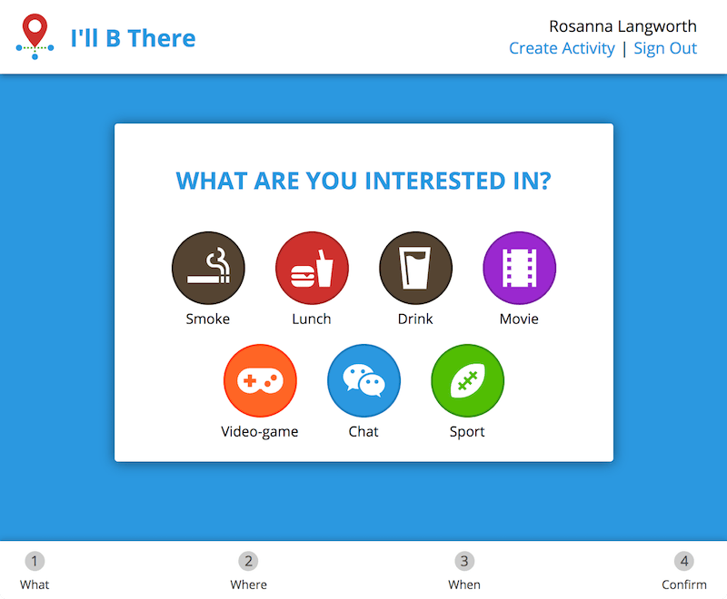
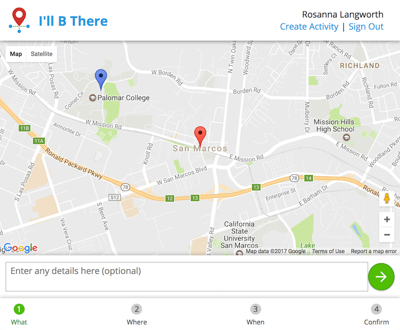
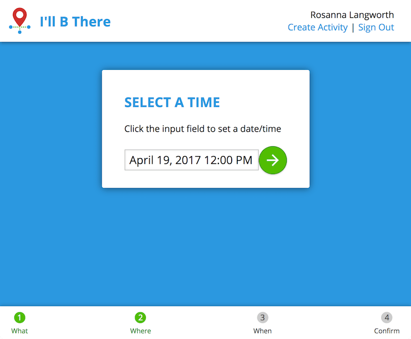
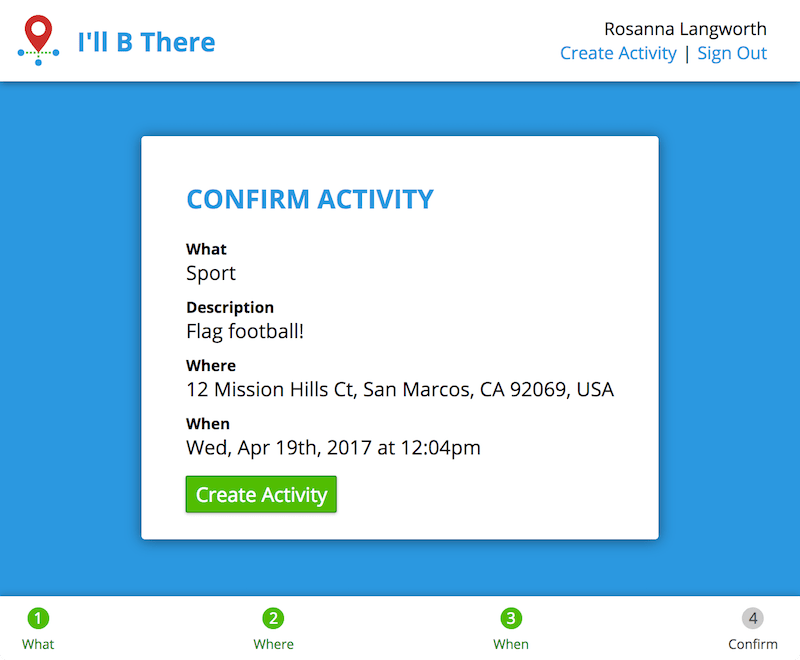

# I'll B There

## About

I'll B There is a short-term event planning service, with an emphasis on socializing and meeting new people. Suppose you want to see a movie this evening, or go out to lunch the next day. I'll B There helps you share and connect with others in your area, whatever the activity.







## Webservice setup

 - [Composer](https://getcomposer.org/download/) is required to install the project.
 - You need a complete development environment with PHP 7, a webserver (Apache) and MySQL (5.7+ prefered)
 - You need a database in your MySQL installation for the project

 Laravel documentation (guide): https://laravel.com/docs/5.4

### Configuring Laravel setup

You only have to do the following once when you're installing the API on your computer for the first time.

```sh
composer install              # Install all the Laravel packages
cp .env.example .env          # Copy the default configuration file
php artisan key:generate      # Generates a new hashing key used to encrypt passwords and stuff
```

You then have to edit the `.env` file to match the information of your environment (mostly database credentials).

### Installing Laravel

You only have to do the following once on the first installation of Laravel on your desktop

```sh
php artisan migrate:refresh --seed    # Creates the database structure and fills it with test / default data
php artisan passport:install          # Generates the client keys for the OAuth2 authentication
```

### Updating Laravel after each pull

You have to launch those commands after every pull

```sh
composer update              # Updates the Laravel packages
php artisan migrate          # Updates the database structure
```

### Running the project

 1. You need a [virtualhost](https://www.digitalocean.com/community/tutorials/how-to-set-up-apache-virtual-hosts-on-ubuntu-14-04-lts) (should be pretty much the same on OS X) pointing to the `public` directory of the Laravel project. Once it is set up you can access the webservice through the URL you set in your virtualhost.
 2. Run the command `php artisan serve` and the project will be available on `http://localhost:8000`.

### Generating the documentation

We use [apiDoc](http://apidocjs.com/) to generate the documentation. Run the following command to build the files:

```sh
apidoc -i app/ -o public/docs/
```

The documentation will be generated and available at http://path.to.illbthere.api/docs

## Front end setup

### Installation

To run the front end, you will need to install the build setup.

First, install Node.js and Brunch (if you haven't already):

```sh
# For macOS
brew install node
npm install -g brunch
```

Then, `cd` into the project's `web` directory (if you haven't already) and run:

```sh
npm install
```

Finally, to start the local front-end server, open a new terminal tab and run:

```sh
brunch watch
```

Brunch is the command-line tool used to build the front end. In order to properly view the front end, the Brunch server must be running in your terminal. This local server will build the project as you change files, and it will inform you of syntactic and stylistic errors in your code.

### Running the project

 1. You need a [virtualhost](https://www.digitalocean.com/community/tutorials/how-to-set-up-apache-virtual-hosts-on-ubuntu-14-04-lts) (should be pretty much the same on OS X) pointing to the `web/www` directory of the project. Once it is set up you can access the webservice through the URL you set in your virtualhost.
 2. Run the command `php artisan serve` and the project will be available on `http://localhost:8000`.
